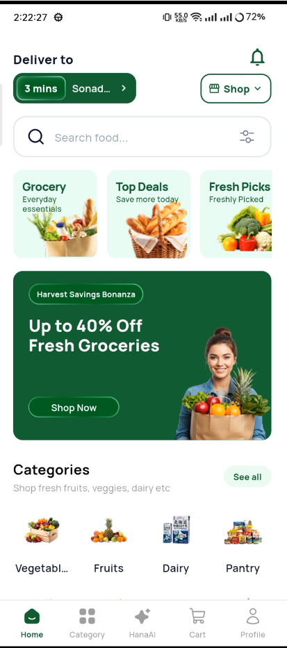
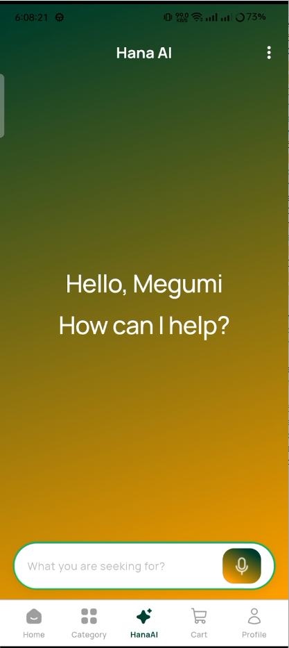
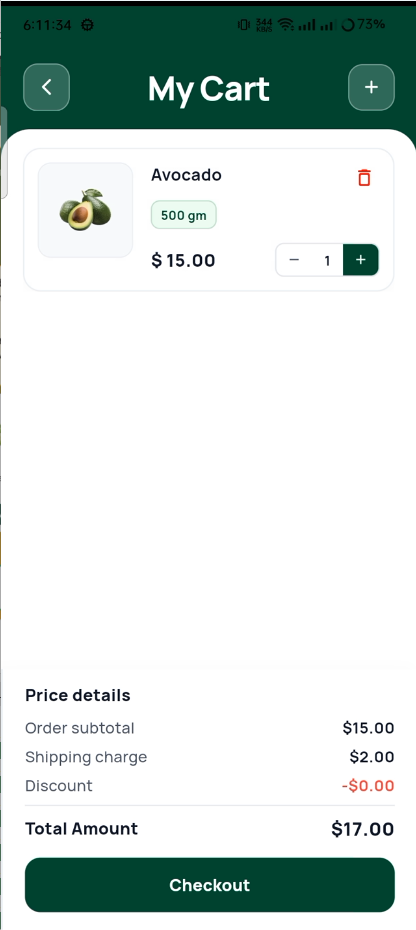
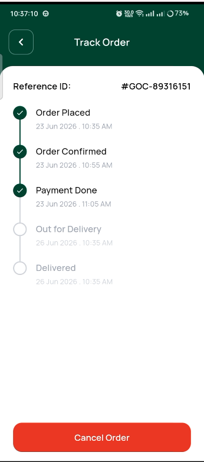

# 🚀 AppStick Engineering Showcase & Contributions

<div align="center">

# MD. Mahfujul Karim Sheikh
### Mobile Application Engineer @ [AppStick Ltd](https://appstick.com.bd)

[](https://flutter.dev)
[](https://dart.dev)
[](https://pub.dev/packages/get)
[](#-engineering-philosophy--architecture)
[](https://www.linkedin.com)

<br/>

*A curated technical showcase of production-grade mobile applications, architectural design, and complex feature implementations delivered during my tenure at **AppStick Ltd**.*

</div>

---

> [!IMPORTANT]
> ### 🔒 Intellectual Property & Source Code Notice
> The source code of all featured projects is proprietary software owned by **AppStick Ltd** and/or its commercial clients. In accordance with strict non-disclosure agreements (NDA) and company confidentiality policies:
> * **Raw proprietary source code is NOT publicly hosted in this repository.**
> * **Purpose:** This repository serves as a professional portfolio documenting technical contributions, system architecture, UI/UX implementation, and business impact.
> * **Commercial & Enterprise Inquiries:** To license, acquire source code, or hire AppStick Ltd for software engineering, please contact **[AppStick Ltd Official Website](https://appstick.com.bd)**.

---

## 📱 Featured Production Projects

| App / Platform | Domain / Category | Core Tech Stack | My Key Contributions | Case Study & Previews |
| :--- | :--- | :--- | :--- | :---: |
| **GreenCart (HanaGo)** | Smart Grocery & AI E-Commerce | Flutter, GetX, AI Voice/Chat, Glassmorphic UI | Full 26+ Screen UI, AI Shopping Assistant, Dynamic Cart & Checkout, Live Order Tracking | [👉 View Case Study](./projects/greencart/README.md) |
| **Vincy Rideshare (User & Driver)** | Real-time On-Demand Ride Sharing | Flutter, GetX, Dio, Google Maps SDK, WebSockets | Driver & Rider real-time GPS tracking, OTP Authentication, Fare Estimator, Ride Flow | *(Case Study Coming Soon)* |
| **Jisr Healthcare & Telemedicine** | Healthcare & Patient Portal | Flutter, GetX, SVG Vectors, Telehealth UI | Patient appointment booking, Doctor schedules, Medical records, Prescription viewer | *(Case Study Coming Soon)* |
| **NutriHealth & Metrics** | Health Monitoring & Vital Analytics | Flutter, GetX, FL Chart, SharedPreferences | Anatomical Body Map, Vital Trend Charts, Health Metric Logging, Local Persistence | *(Case Study Coming Soon)* |
| **Xpen-Stick** | Fintech & Enterprise Expense Tracker | Flutter, Lottie, SMS Autofill, Maps | Expense categorization, Visual analytics, OTP verification, Interactive maps | *(Case Study Coming Soon)* |
| **Blood Bank & Donation Network** | Emergency Health Services | Flutter, Geo-Location, Donor Finder | Emergency blood request broadcast, Donor matchmaking, Direct calling integration | *(Case Study Coming Soon)* |

---

## 🛒 Deep-Dive: GreenCart (HanaGo)

<div align="center">






<br/><br/>

[](./projects/greencart/README.md)
[](https://mmks735.github.io/greencart/)

</div>

### Highlights of GreenCart
* 🤖 **AI-Powered Shopping Assistant:** Conversational chat & voice recognition for instant product discovery and direct-to-cart operations.
* 🛍️ **Complete E-Commerce Flow:** 26+ screens encompassing catalog browsing, search filters, cart with voucher logic, and multi-step checkout.
* 🎨 **Glassmorphism Design:** Modern aesthetic with custom animations and smooth 60fps scrolling.
* 📖 **[Explore Full GreenCart Case Study & UI Previews &rarr;](./projects/greencart/README.md)**

---

## 🛠️ Core Engineering Skillset

```
                       ┌─────────────────────────┐
                       │  Mobile App Engineering │
                       └────────────┬────────────┘
                                    │
         ┌──────────────────────────┼──────────────────────────┐
         │                          │                          │
┌────────┴─────────┐       ┌────────┴─────────┐       ┌────────┴─────────┐
│ State Management │       │  Architecture    │       │ Integrations     │
│ • GetX           │       │ • Clean Arch     │       │ • Dio / REST API │
│ • Provider       │       │ • Feature-First  │       │ • Google Maps    │
│ • Reactive Binds │       │ • Repository     │       │ • Lottie / SVG   │
└──────────────────┘       └──────────────────┘       └──────────────────┘
```

- **Framework & Languages:** Flutter 3.x, Dart 3.x, JavaScript/TypeScript (Docusaurus)
- **State Management & Architecture:** GetX (Controllers, Bindings, Reactive State), Clean Architecture, Feature-First MVVM
- **Networking & Data:** Dio with interceptors, JWT token refresh, Offline Caching, Shared Preferences
- **UI & Animations:** Glassmorphic UI design, Custom Painter, Lottie animations, FL Chart data visualization
- **DevOps & Tooling:** Git, GitHub Actions, Docusaurus documentation engine

---

## 📬 Contact & Links

* **GitHub:** [@mmks735](https://github.com/mmks735)
* **Company:** [AppStick Ltd](https://appstick.com.bd)
* **Location:** Khulna, Bangladesh

---
<div align="center">
<sub>Designed & Maintained by MD. Mahfujul Karim Sheikh • Powered by Flutter & Markdown</sub>
</div>
