# 🛒 GreenCart — Smart AI-Powered Grocery & E-Commerce Flutter App

<div align="center">

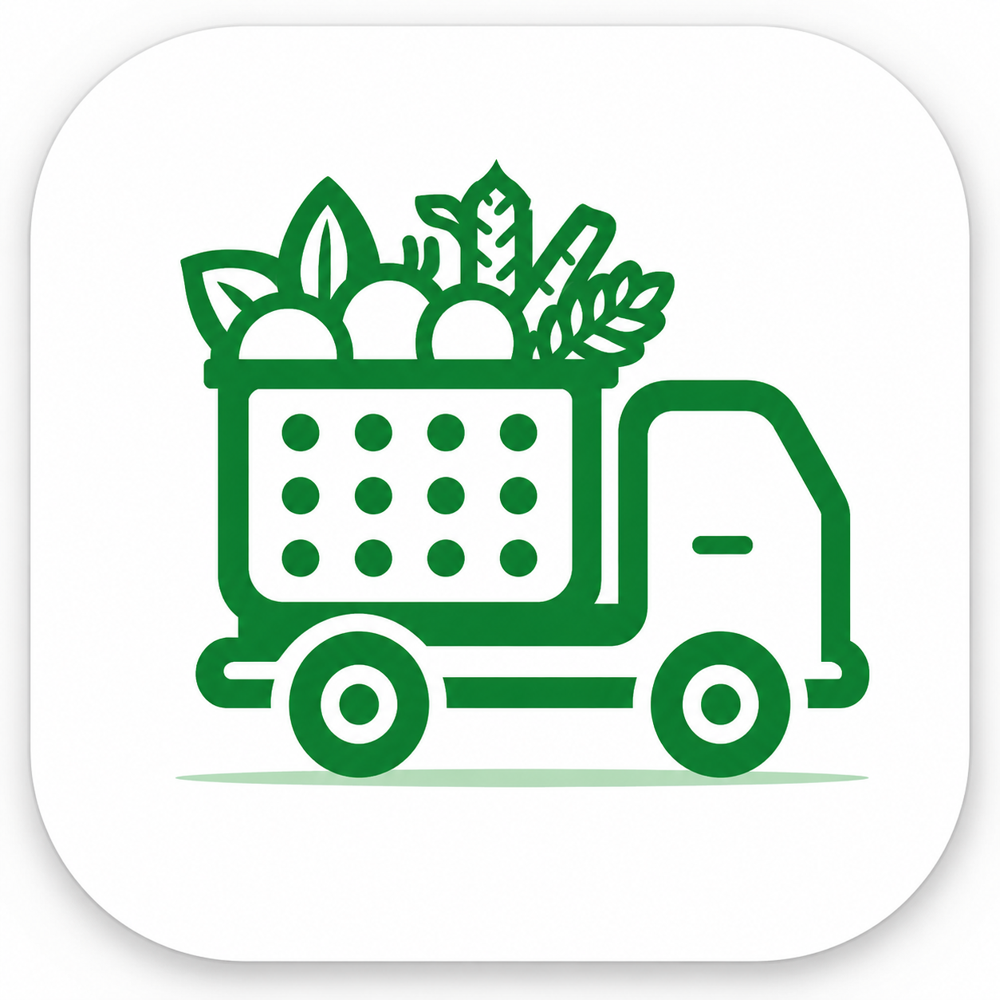

### Next-Generation Production-Grade Mobile Application with AI Shopping Assistant
Developed at **[AppStick Ltd](https://appstick.com.bd)** • Engineered by **[MD. Mahfujul Karim Sheikh (mmks735)](https://github.com/mmks735)**

<br/>

[](https://mmks735.github.io/greencart/)
[](https://mmks735.github.io/greencart/)
[](https://flutter.dev)
[](https://dart.dev)
[](https://pub.dev/packages/get)
[](#-ui-showcase--screen-previews)

<br/>

**[🌐 Visit Live Documentation & User Guide](https://mmks735.github.io/greencart/)** • **[🏢 Contact AppStick Ltd](https://appstick.com.bd)**

</div>

---

> [!IMPORTANT]
> ### 🔒 Intellectual Property & Proprietary Code Notice
> **GreenCart** is a proprietary commercial mobile application template developed at **AppStick Ltd** for enterprise clients and commercial distribution.
> * **Code Privacy:** To comply with company NDA, client confidentiality, and intellectual property rights, **the raw backend API keys and proprietary commercial source code are not publicly hosted in this repository**.
> * **Purpose of this Repository:** This repository serves as a dedicated technical showcase, engineering case study, UI/UX preview gallery, and interactive documentation hub for the GreenCart platform.
> * **Need the Code or Commercial License?** To acquire a commercial license, source code access, or enterprise customization, please contact **[AppStick Ltd](https://appstick.com.bd)** directly.

---

## 📌 Project Overview

**GreenCart** is a modern, high-performance Smart Grocery Shopping & E-Commerce Flutter mobile application. Engineered for supermarkets, grocery delivery chains, and organic food retailers, it combines a sleek **glassmorphic design system** with an integrated **AI shopping assistant** supporting both natural language text and voice interactions.

### 🌟 Key Highlights
- 🤖 **Integrated AI Shopping Assistant:** Text chat and voice recognition for intelligent grocery search, personalized recommendations, and direct-to-cart operations.
- 🛍️ **Complete End-to-End Shopping Engine:** Catalog browsing, smart search with category filtering, wishlist, cart with voucher logic, and multi-step checkout.
- 📍 **Real-time Order Tracking:** Interactive milestone stepper for live tracking of grocery deliveries from confirmation to doorstep arrival.
- 🎨 **Modern Glassmorphic UI:** Bespoke visual tokens, micro-interactions, responsive typography, and smooth 60fps scrolling.
- 🌐 **Multi-Language Support:** Translation architecture supporting multiple locales with clean JSON localization files.
- 📚 **Full Technical Documentation:** Integrated Docusaurus-powered developer portal live on GitHub Pages.

---

## 👨‍💻 My Role & Key Contributions

As a core **Mobile Application Engineer** on this project at **AppStick Ltd**, I led the engineering of key modules:

### 1. System Architecture & Reactive State (GetX)
* Structured the entire project using **Clean / Feature-First Architecture** to maintain clean boundaries between data, domain, and presentation layers.
* Utilized **GetX Controllers & Bindings** for reactive state handling across cart calculations, authentication states, product filtering, and dynamic voucher discounts.

### 2. GreenCart AI Assistant Module
* Built the dedicated conversational AI interface supporting both text queries and speech-to-text voice input.
* Designed custom audio wave animations for voice recognition states.
* Implemented interactive product cards embedded directly within the AI conversation feed.

### 3. Shopping & Checkout Experience
* **Dynamic Cart:** Reactive subtotal, VAT/tax handling, delivery fee calculation, and instant promo code validation.
* **Multi-Step Checkout:** Address picker, scheduled delivery date/time slot selector, and payment options (Card, COD, Mobile Wallet).
* **Live Order Tracking:** Step-by-step visual delivery status monitor.

### 4. Developer Documentation Hub
* Authored and published the complete interactive documentation portal using **Docusaurus**, covering project setup, folder structure, API integration, and screen-by-screen code reference.

---

## 📱 UI Showcase & Screen Previews

<div align="center">

### 🌟 Home Experience & Category Browsing
| Welcome & Onboarding | Glassmorphic Home Feed | Category Catalog | Featured Deals & Offers |
| :---: | :---: | :---: | :---: |
| 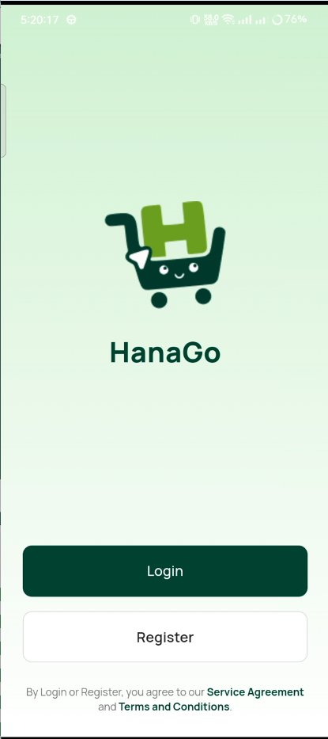 |  | 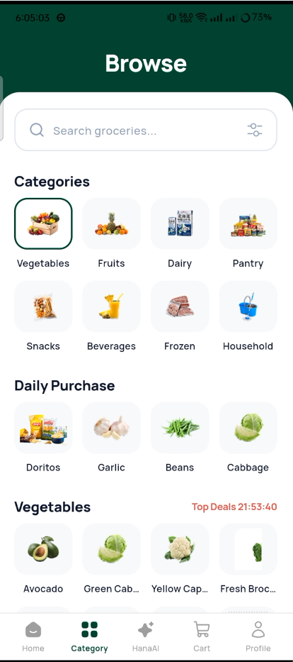 | 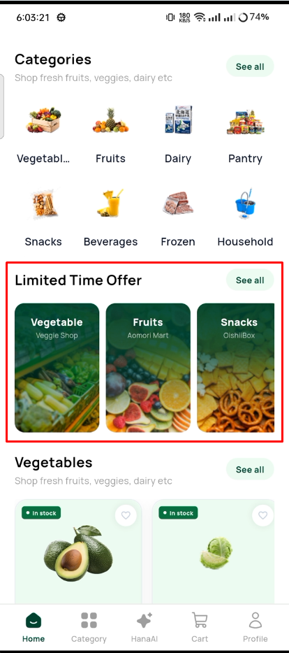 |

### 🤖 GreenCart AI Assistant (Text & Voice)
| AI Home Entry | AI Chat Feed | Voice Interaction State | AI Recommended Product |
| :---: | :---: | :---: | :---: |
| 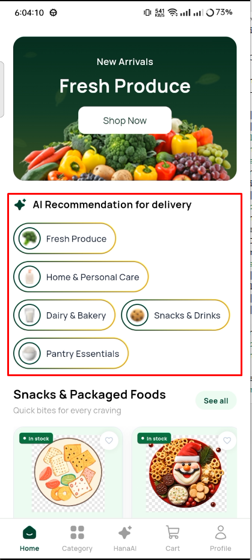 |  |  | 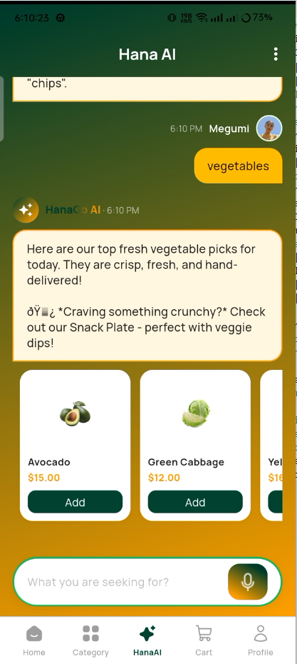 |

### 🛒 Shopping, Cart & Checkout Flow
| Product Details | Dynamic Cart | Checkout & Time Slot | Order Confirmed |
| :---: | :---: | :---: | :---: |
| 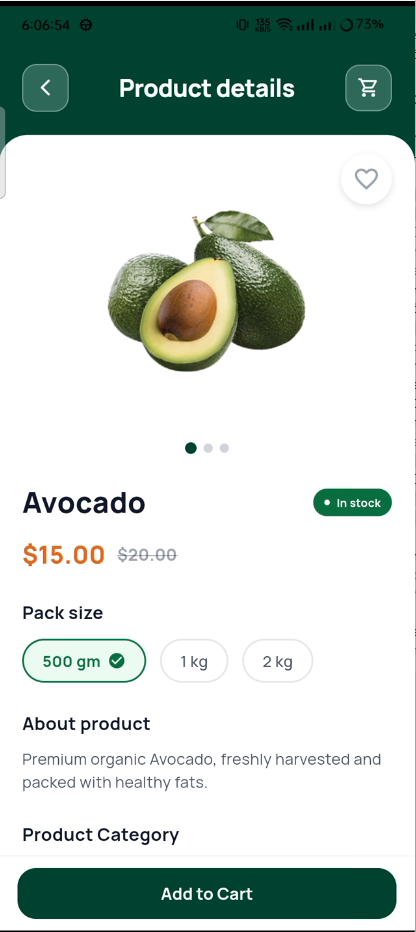 |  | 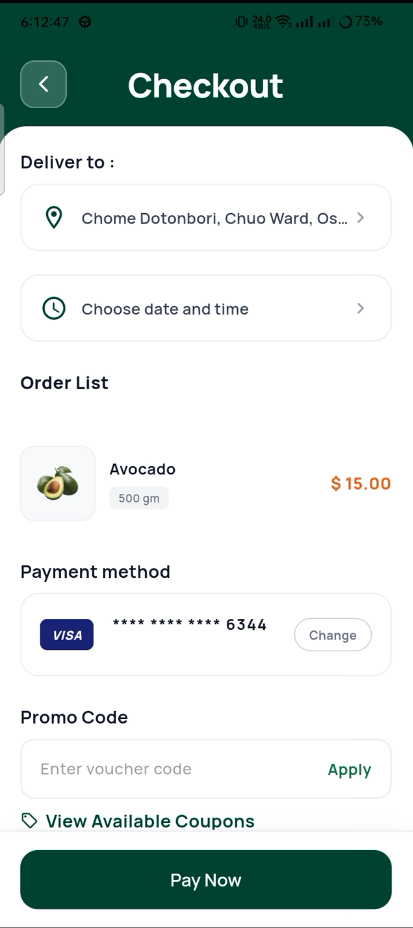 | 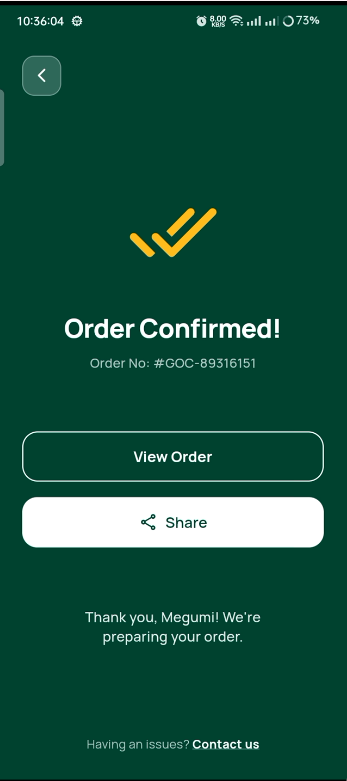 |

### 📦 Order Management & Account
| Live Order Tracking | Order History | Saved Addresses | Notification Center |
| :---: | :---: | :---: | :---: |
|  | 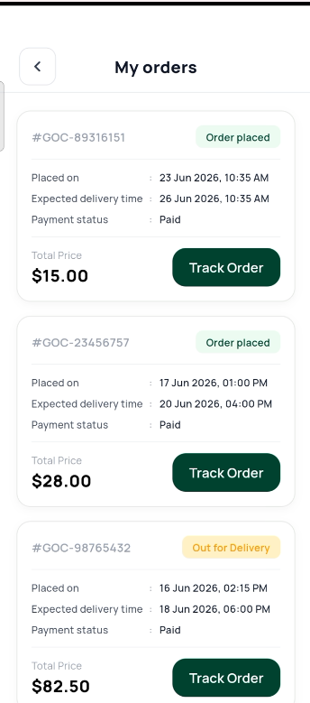 | 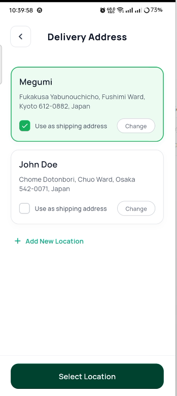 | 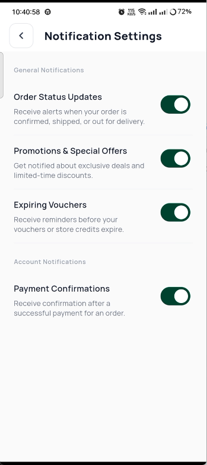 |

</div>

---

## 🏗️ Technical Architecture

```
lib/
├── app/
│   ├── data/                 # Models, local datasets, API providers
│   │   ├── models/           # ProductModel, CategoryModel, OrderModel, CartItemModel
│   │   └── providers/        # REST API clients & JSON data providers
│   ├── modules/              # Feature modules (View + Controller + Binding)
│   │   ├── home/             # Home feed, banner carousels, category cards
│   │   ├── ai_assistant/     # Conversational AI chat, voice visualizer
│   │   ├── cart/             # Reactive cart controller, voucher logic
│   │   ├── checkout/         # Delivery slot picker, address & payment flows
│   │   ├── order/            # Live tracking stepper, receipt details
│   │   └── product/          # Product details, image gallery, reviews
│   ├── routes/               # GetX AppPages & AppRoutes
│   └── theme/                # Glassmorphic color tokens, typography, shadows
└── main.dart                 # App initialization, localization bindings
```

### 🧰 Tech Stack & Libraries

| Category | Technology / Package | Purpose |
| :--- | :--- | :--- |
| **Framework** | [Flutter 3.x](https://flutter.dev) | Cross-platform UI toolkit (Android & iOS) |
| **Language** | [Dart 3.x](https://dart.dev) | Strict null-safe core programming language |
| **State Management** | `get: ^4.6.6` | Reactive state handling, dependency injection & routing |
| **Icons & Vectors** | `flutter_svg: ^2.0.16` | High-definition SVG asset rendering |
| **Date & Currency** | `intl: ^0.20.2` | Date formatting, internationalization & currency parsing |
| **Documentation** | [Docusaurus 3.x](https://docusaurus.io) | Interactive documentation portal hosted on GitHub Pages |

---

## 📖 Live Documentation Website

The full documentation for **GreenCart** is published and accessible online:

👉 **[https://mmks735.github.io/greencart/](https://mmks735.github.io/greencart/)**

The documentation includes:
- **Getting Started:** Installation guide, prerequisites, VS Code & Android Studio setup.
- **Project Structure:** Deep-dive into controllers, models, and clean architecture.
- **Screen & Code Reference:** Visual side-by-side view of all 26+ screens with corresponding source code snippets.
- **Customization Guide:** Theming, product catalog modification, REST API integration, and multi-language setup.

---

## 📬 Business & Hiring Inquiries

* **Developer:** MD. Mahfujul Karim Sheikh ([@mmks735](https://github.com/mmks735))
* **Role:** Mobile Application Engineer @ AppStick Ltd
* **Company:** [AppStick Ltd](https://appstick.com.bd)
* **Location:** Khulna, Bangladesh

---

<div align="center">
<sub>Designed & Maintained by MD. Mahfujul Karim Sheikh • Built with Flutter & Docusaurus</sub>
</div>
